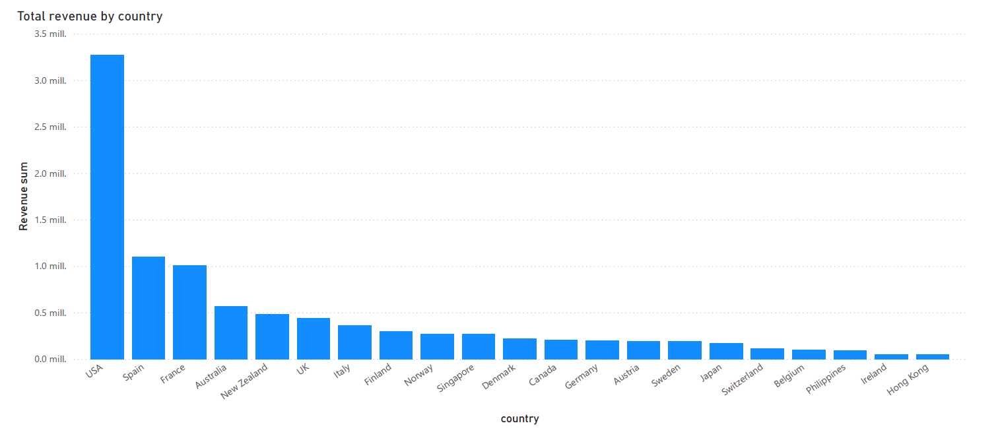
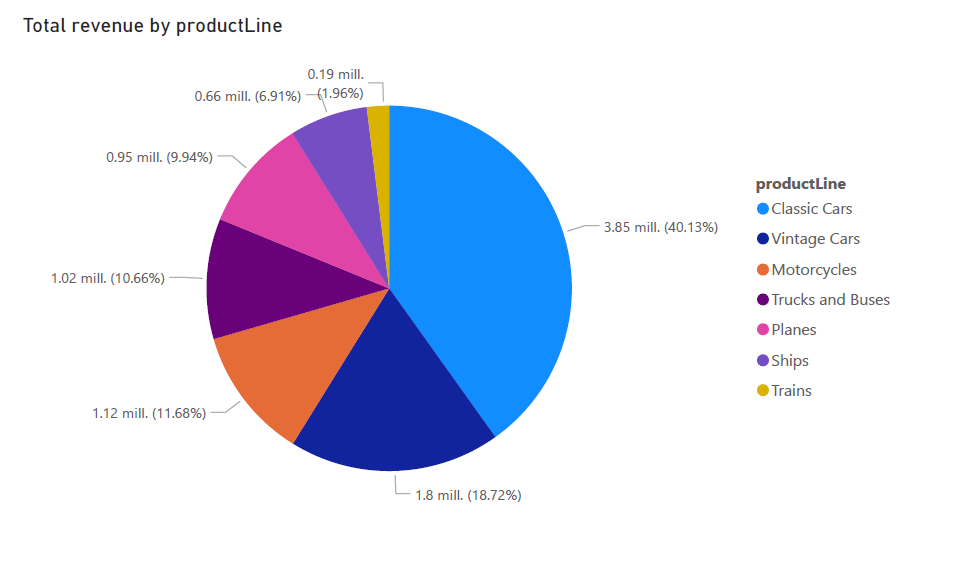
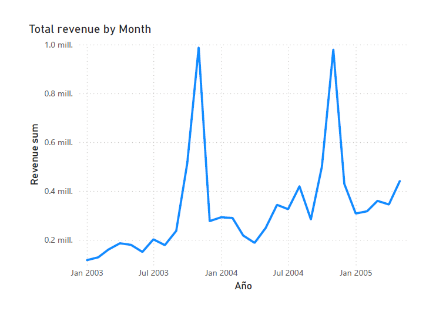

# Sales KPIs Analysis

This document summarizes key performance indicators derived from transactional data. It highlights trends and insights useful for business optimization.

## Total Revenue

-- Total revenue
SELECT SUM(revenue) AS total_revenue 
FROM fact_sales;

The total revenue for the entire company is $9,604,190.61

## Revenue by country

Revenue is concentrated in USA, likely reflects a mature market with established brand presence. Then Spain and France offer regional marketing opportunities, as well as for  Australia and New Zealand.

## Revenue by product line

Revenue is heavily concentrated in Classic Cars, which account for over 40% of total sales. The next tier includes Vintage Cars, Motorcycles, and Trucks and Buses, each contributing meaningfully to the overall revenue. 

## Total revenue by Month

Revenue shows clear seasonal peaks in December 2003 and December 2004,suggests end-of-year demand surges (gifts purchasing, year end spending). Also, there is a visible upward trajectory in revenue, suggesting a positive growth trend.

